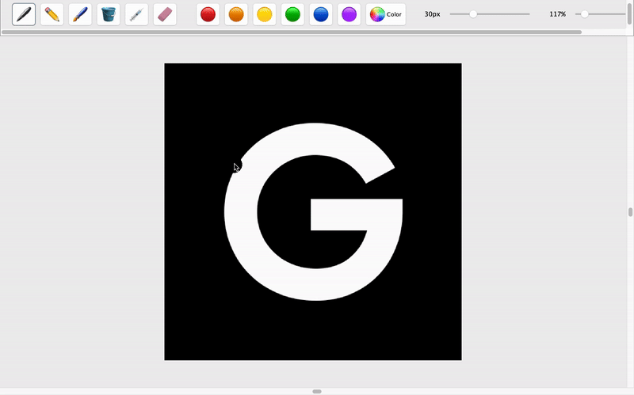

# DrawAnt

## Description
DrawAnt is a Java-based drawing application, offering a suite of tools for digital artwork creation. This application is developed using Java and is built with Apache Ant, making it easily integrable with modern IDEs like NetBeans.

## Features
- Various drawing tools including pencils, brushes, and erasers
- A color palette for choosing and applying different colors
- Has undo and redo functionality
- Allows for zooming in and out on the canvas
- Can export drawings as a png or jpg file

## Installation

### Prerequisites
- Java JDK 19 or later.
- Apache Ant (for building the project).
- NetBeans IDE (recommended for easy setup and run).

### Setup
1. Clone or download the `DrawAnt` repository.
2. Open the project in NetBeans IDE or your Java IDE of choice.
3. Build the project using Ant: `ant clean install`.

## Running the Application
- After building, run `DrawAnt.jar` located in the `dist` directory.
- Alternatively, use your IDE's run configuration to start the application.

## Contributing
Contributions to the DrawAnt project are welcome. Feel free to fork the repository, make improvements, and submit pull requests.

## License
[MIT License](LICENSE.md) - feel free to use and modify this application as you see fit.
